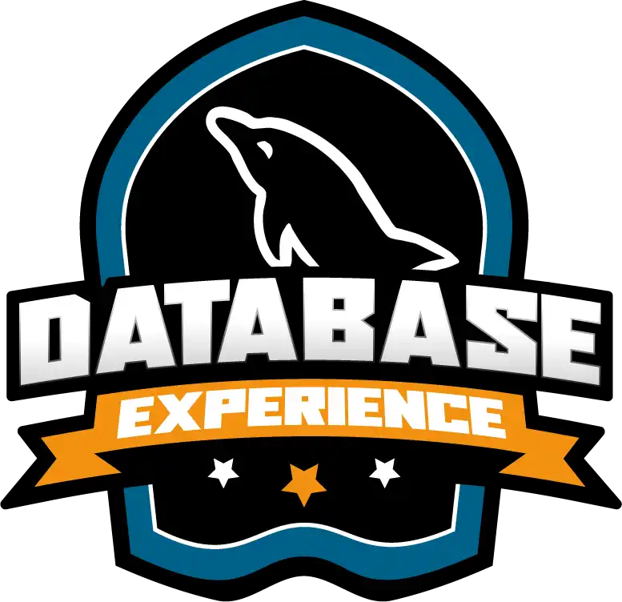

# 
Database Experience - Bootcamp

 

 Este é o primeiro bootcamp sobre Banco de Dados da DIO para profissionais que procuram uma experiência rápida em Ciência de Dados para se aprimorar nos principais conceitos de banco de dados SQL e NoSQL. No Database Experience você vai passar por 54 horas de imersão, com experiências educacionais e mentorias exclusivas sobre modelagem de dados, SGBD, EER, arquitetura, queries entre outras.     

## 
**Atividades**:
  

- [x] **Prepare-se para a jornada**

  - [x] Curso : Conheça as Oportunidades da DIO
  - [x] Curso : Seja Protagonista Neste Bootcamp
  - [x] Curso : Introdução ao Desenvolvimento Moderno de Software
  - [x] Curso : Introdução ao Git e ao GitHub
  - [x] Curso : Criando seu Primeiro Repositório no GitHub Para Compartilhar Seu Progresso
  - [x] Curso : Mentoria (Live) - Database Experience | Aula inaugural - 22/08/2022 às 19h

- [ ] **Banco de Dados SQL**

  - [ ] Curso : Contextualização do Cenário na  Área de Banco de Dados
  - [ ] Curso : Explorando a Abordagem de SGBDs
  - [ ] Curso : Overview sobre Modelagem de Dados
  - [ ] Curso : Arquitetura de Bando de Dados
  - [ ] Curso : Fundamentos de Modelagem e Projeto de Banco de Dados
  - [ ] Curso : Explorando o Modelo ER - Entidade Relacionamento
  - [ ] Curso : Modelagem de Dados com EER - Enhanced Entity Relationship
  - [ ] Curso : Refinando um Projeto Conceitual de Banco de Dados - E-COMMERCE
  Curso : Construindo um Esquena Conceitual do Zero
  - [ ] Curso : Modelo Relacional e Mapeamento ER/Relacional
  - [ ] Curso : Primeiros Passos com SQL
  - [ ] Curso : Explorando Queries com SQL
  - [ ] Curso : Criando Queries com Funções e Cláusulas de Agrupamentos
  - [ ] Curso : Agrupando Registros e Tabelas com Join Statement
  - [ ] Curso : Construindo seu Primeiro Projeto Lógico de Banco de Dados
  - [ ] Curso : Construa um Projeto Lógico de Banco de Dados do Zero

- [ ] **Bancos de Dados NoSQL**

  - [ ] Curso : Introdução ao MongoDB e Bancos de Dados NoSQL
  - [ ] Curso : O Papel dos Bancos de Dados SQL e NoSQL na Engenharia de Dados 
